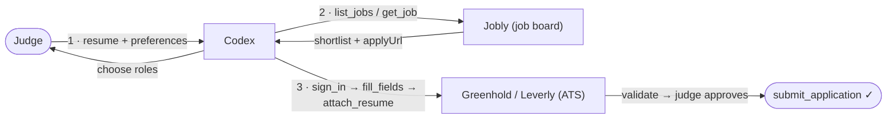

# Jobly: turn a resume into a completed application, not another abandoned form

Job applications often fail before a candidate can make their case. A promising role becomes a
relay of unfamiliar portals, repeated resume uploads, and long forms asking for information
that already exists in the resume. By the last page, the candidate has spent their attention on
administration instead of the opportunity.

Jobly demonstrates a different path. The candidate gives Codex their resume and preferences.
Codex identifies relevant roles on Jobly, the candidate chooses which opportunity is worth
pursuing, and Codex uses each employer portal's explicit WebMCP tools to carry the application
forward. The candidate stays in control of the role, their information, and the final submit;
WebMCP takes over the repetitive work between those decisions.

**Live:**
- Jobly (portal): https://webmcp-jobs-portal.vercel.app
- Greenhold (ATS): https://webmcp-jobs-greenhold.vercel.app
- Leverly (ATS): https://webmcp-jobs-leverly.vercel.app

Backend: one shared Convex production deployment (`sincere-rat-11`).

| App | Role | Port (dev) |
| --- | --- | --- |
| **Jobly** (`apps/portal`) | Job board, Indeed-style | 5173 |
| **Greenhold** (`apps/ats-greenhouse`) | Greenhouse-style ATS, 5-step wizard | 5174 |
| **Leverly** (`apps/ats-lever`) | Lever-style ATS, single page | 5175 |

## Judge testing path

Open Jobly (https://webmcp-jobs-portal.vercel.app) in ChatGPT's in-app browser, which supports
WebMCP, or in Google Chrome with WebMCP testing enabled. Each site displays a **WebMCP
connected** badge when an agent surface is available. The whole test is three actions:

1. **Give Codex a resume.** Attach a resume in the chat and state preferences (role, location,
   work mode, salary). If you don't have one handy, use the ready-made
   [`sample-resume.pdf`](./sample-resume.pdf) in the repo root.
2. **Ask Codex to find relevant jobs.** With Jobly open, ask it to find roles that match the
   resume. Codex uses Jobly's `list_jobs` / `get_job` tools and returns a shortlist with each
   role's `applyUrl`. Pick the ones worth pursuing.
3. **Ask Codex to apply.** Codex opens each `applyUrl`, signs in to the ATS, inspects the real
   form, fills it from the resume, and attaches the files. It pauses for your approval, then
   `submit_application` returns a confirmation ID — verify it under **My applications**.



Steps 2 and 3 exercise **structurally different forms** — Greenhold's five-step wizard and
Leverly's single page — through the same tool contract; Codex adapts by inspecting each form
rather than replaying a script.

## The WebMCP surface

The same applicant journey crosses three independent sites. Rather than guessing at the UI,
Codex asks each site what it can do, then follows the structured answer.

| Website | Tool group | Exposed WebMCP tools | What Codex can do |
| --- | --- | --- | --- |
| **Jobly** | Discover | `get_filter_options`, `list_jobs` | Learn the available filters and find jobs that match the candidate's role, skills, location, work mode, or salary preferences. |
| **Jobly** | Understand | `get_job` | Read the selected job's full requirements and receive its `applyUrl`. |
| **Greenhold** | Account and posting | `sign_in`, `get_account`, `get_job` | Sign in to the simulated ATS, confirm the account, and inspect the job posting. |
| **Greenhold** | Understand the form | `get_application_form`, `get_page_fields`, `get_current_page` | Inspect the complete five-step form and see exactly which fields remain on the current page. |
| **Greenhold** | Complete the application | `start_application`, `fill_fields`, `attach_resume`, `attach_cover_letter`, `goto_page`, `next_page`, `prev_page`, `validate_application`, `submit_application` | Fill, move through, validate, and submit a multi-page Greenhouse-style application. |
| **Leverly** | Account and posting | `sign_in`, `get_account`, `get_job` | Sign in to the simulated ATS, confirm the account, and inspect the job posting. |
| **Leverly** | Understand the form | `get_application_form`, `get_page_fields`, `get_current_page` | Inspect the single-page form and see its required fields and current state. |
| **Leverly** | Complete the application | `start_application`, `fill_fields`, `attach_resume`, `attach_cover_letter`, `goto_page`, `next_page`, `prev_page`, `validate_application`, `submit_application` | Fill, validate, and submit a Lever-style application; navigation tools remain available so one agent contract works across both ATS designs. |

Greenhold and Leverly expose the same agent contract but render **structurally different forms**.
That difference is intentional: the agent must inspect and adapt to each application experience
instead of relying on a hardcoded sequence of clicks.

Each ATS listing lives at its own URL, `/jobs/<id>`, which opens the **job posting**
(description, requirements, salary, skills) with an "Apply for this role" button that
reveals the multi-page form — like a real Greenhouse/Lever page.

The journey is concrete: Codex starts with the candidate's resume and preferences, uses Jobly
to find and inspect suitable roles, opens an approved `applyUrl`, learns the ATS form before it
touches it, then fills, validates, and submits the application. Submissions persist to Convex,
and the mutating tools keep the visible human view in sync with the agent's progress.

## Why WebMCP

This is not a UI-scraping demonstration. Jobly exposes structured search and job-detail tools;
the two ATS sites expose their jobs, form schemas, page state, file attachment, validation, and
submission actions directly. That lets Codex adapt to a multi-page Greenhouse-style form and a
single-page Lever-style form without guessing which controls are present or whether a required
field is complete.

The human keeps control of the consequential choices: which roles to pursue, what information
to provide, and when an application should be submitted. WebMCP handles the mechanical work
between those decisions.

## Architecture

- **Monorepo** (npm workspaces): three Vite + React + TypeScript apps, three shared
  packages.
  - `packages/webmcp` — WebMCP registration glue, tool helpers, and the
    `Origin-Agent-Cluster` Vite plugin (WebMCP requires origin isolation).
  - `packages/convex` — the **shared** Convex backend (`jobs` + `applications`). The only
    package that deploys the backend; all three apps point at the same `VITE_CONVEX_URL`.
  - `packages/ats-core` — a config-driven form engine (store, validation, submit mapping,
    WebMCP tools, React renderer) shared by both ATS sites.
- WebMCP tools call Convex **imperatively** (`convex.query/mutation`), so the agent path
  and the React UI share one backend and, in the ATS apps, one in-page form store.

## Setup

Requires Node 18+ and a Convex account.

```bash
npm install

# 1. Backend: create a Convex dev deployment (writes VITE_CONVEX_URL to
#    packages/convex/.env.local). Leave running, or use --once.
cd packages/convex
npx convex dev --once        # or: npx convex dev  (watch mode)

# 2. Seed ~120 job listings
npm run gen                  # regenerate seed/jobs.jsonl (optional; already committed)
npm run seed                 # convex import --table jobs --replace
```

Each app reads `VITE_CONVEX_URL` from its own environment. In dev, copy the value Convex
wrote into `packages/convex/.env.local` into each app's `.env.local` (or export it), e.g.:

```
VITE_CONVEX_URL=https://<your-deployment>.convex.cloud
```

The portal also accepts `VITE_ATS_GREENHOUSE_URL` and `VITE_ATS_LEVER_URL` (default
`http://localhost:5174` / `:5175`).

## Run

```bash
npm run dev:portal       # http://localhost:5173
npm run dev:greenhouse   # http://localhost:5174
npm run dev:lever        # http://localhost:5175
```

Open in ChatGPT's in-app browser or Chrome with WebMCP testing enabled. Each page shows a
"WebMCP connected" badge when an agent surface is present.

### Drive the tools without an agent (dev)

Every app exposes its tools on `window` in dev: `__portal`, `__greenhold`, `__leverly`.

```js
await __portal.tools.list_jobs.execute({ discipline: 'backend', remoteOnly: true })
await __greenhold.tools.get_application_form.execute({})
await __greenhold.tools.fill_fields.execute({ values: { firstName: 'Jane', email: 'j@x.com' } })
```

## Deploy (Vercel)

Deploy the backend once from `packages/convex` (`npx convex deploy`), then create three
Vercel projects, each with **Root Directory** set to its app folder, a plain
`npm run build`, and `VITE_CONVEX_URL` set to the production deployment URL (plus the two
`VITE_ATS_*_URL` vars on the portal). The `Origin-Agent-Cluster: ?1` header ships via each
app's `vercel.json`.

## Build / typecheck

```bash
npm run build   # tsc --noEmit && vite build for all three apps
```
